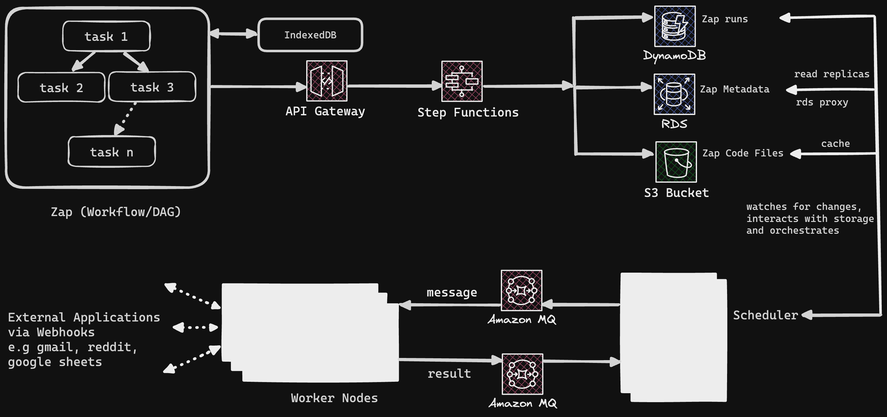

# GOAL
Design a workflow automation service like Zapier

# Design Features
- Create Zap
- Run Zap

# Design Requirements
- Scalability
- Highly Available
- Cost Effective
- Secure

# Design

# High-level Overview
A Zap is a workflow which is essentially a Directed Acyclic Graph (DAG). 

When a user starts creating a DAG, it's stored on IndexedDB on the user's web browser for fast retrievals. When the user clicks on publish, it a call is made to APIGateway, which triggers Step Functions that stores i) the Zap Metadata in PostgreSQL, ii) the Zap Code File(s) in S3 iii) and keeps track of the Zap runs in DynamoDB.

A Scheduler interacts with these 3 storage components to orchestrate necessary actions based on any changes. When the Scheduler sees that a user's published Zap is still in a pending state, it takes it associated data and puts that on a Queue to be processed by a Worker Node. It also updates the Zap data in the storage components, e.g the zap run status from pending to scheduled

The Worker consumes this message, and when it is done executing, it informs the Scheduler, which interacts with the storage components to update the Zap data details, e.g from sheduled to running 

# Detailed overview
To be continued

# Improvements
To be continued